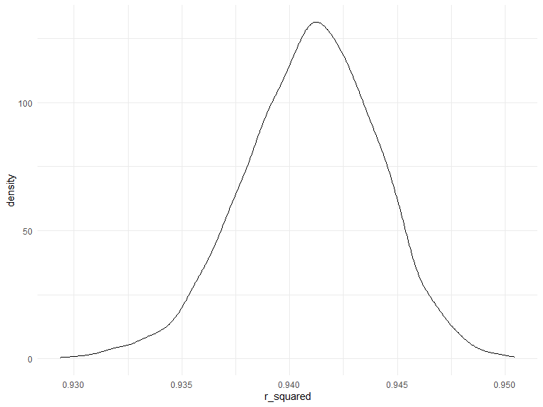
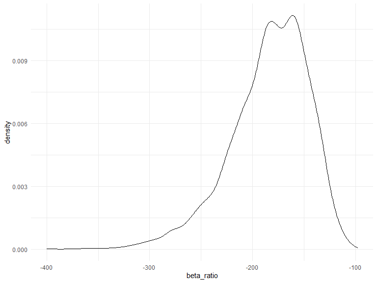
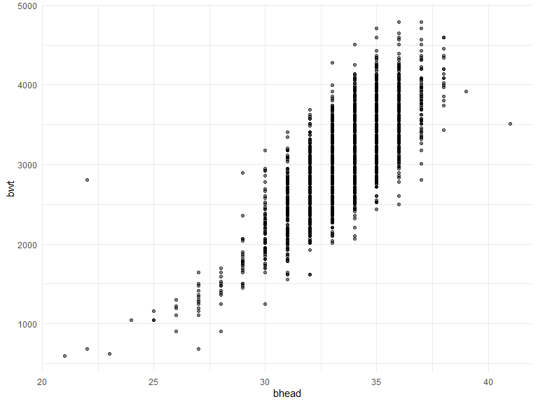
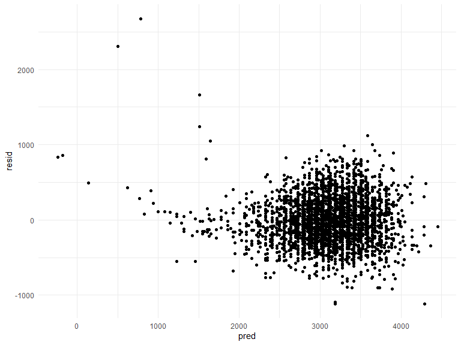
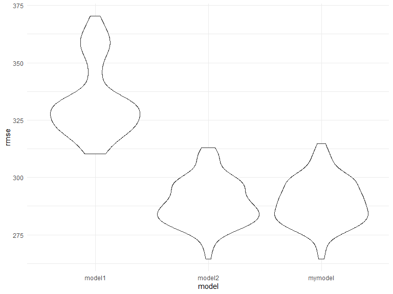

p8105_hw6_vc2692
================
Vaidehi Chudgar
2025-11-29

``` r
library(tidyverse)
```

    ## Warning: package 'tidyverse' was built under R version 4.5.2

    ## ── Attaching core tidyverse packages ──────────────────────── tidyverse 2.0.0 ──
    ## ✔ dplyr     1.1.4     ✔ readr     2.1.5
    ## ✔ forcats   1.0.0     ✔ stringr   1.5.1
    ## ✔ ggplot2   3.5.2     ✔ tibble    3.2.1
    ## ✔ lubridate 1.9.4     ✔ tidyr     1.3.1
    ## ✔ purrr     1.1.0     
    ## ── Conflicts ────────────────────────────────────────── tidyverse_conflicts() ──
    ## ✖ dplyr::filter() masks stats::filter()
    ## ✖ dplyr::lag()    masks stats::lag()
    ## ℹ Use the conflicted package (<http://conflicted.r-lib.org/>) to force all conflicts to become errors

``` r
library(broom)
library(knitr)
library(p8105.datasets)
library(modelr)
```

    ## 
    ## Attaching package: 'modelr'
    ## 
    ## The following object is masked from 'package:broom':
    ## 
    ##     bootstrap

``` r
knitr::opts_chunk$set(
    echo = TRUE,
    warning = FALSE,
    fig.width = 8, 
  fig.height = 6,
  out.width = "90%"
)

theme_set(theme_minimal() + theme(legend.position = "bottom"))

options(
  ggplot2.continuous.colour = "viridis",
  ggplot2.continuous.fill = "viridis"
)

scale_colour_discrete = scale_colour_viridis_d
scale_fill_discrete = scale_fill_viridis_d
```

## Problem 1

First I read in data and conduct data cleaning steps.

``` r
homicide_df =
  read_csv("data/homicide-data.csv", na = c(".", "NA", "")) 
```

    ## Rows: 52179 Columns: 12
    ## ── Column specification ────────────────────────────────────────────────────────
    ## Delimiter: ","
    ## chr (9): uid, victim_last, victim_first, victim_race, victim_age, victim_sex...
    ## dbl (3): reported_date, lat, lon
    ## 
    ## ℹ Use `spec()` to retrieve the full column specification for this data.
    ## ℹ Specify the column types or set `show_col_types = FALSE` to quiet this message.

``` r
# data cleaning steps
homicide_df = 
  homicide_df |> 
  unite(city_state, city, state, sep = ", "  ) |> 
  mutate(
    solved = as.numeric(disposition == "Closed by arrest"),
    victim_age = as.numeric(victim_age)
    ) |> 
  filter(
    !city_state %in% c("Tulsa, AL", "Dallas, TX", "Phoenix, AZ", "Kansas City, MO"),
    victim_race %in% c("White", "Black")
    )
```

Fitting a logistic regression with resolved vs unresolved as the outcome
and victim age, sex and race as predictors for Baltimore.

``` r
# filter to baltimore
baltimore_df = 
  homicide_df |> 
  filter(city_state == "Baltimore, MD")

# getting OR estimate and confidence interval
baltimore_model =
  glm(solved ~ victim_age + victim_sex + victim_race,
            data = baltimore_df,
            family = binomial()) |> 
  broom::tidy() |> 
  mutate(
    OR = exp(estimate),
    CI_lower = exp(estimate - 1.96*std.error),
    CI_upper = exp(estimate + 1.96*std.error)
  ) |> 
  select(term, OR, CI_lower, CI_upper) |> 
  filter(term == "victim_sexMale") |> 
  knitr::kable(digits = 2)


print(baltimore_model)
```

    ## 
    ## 
    ## |term           |   OR| CI_lower| CI_upper|
    ## |:--------------|----:|--------:|--------:|
    ## |victim_sexMale | 0.43|     0.32|     0.56|

Fitting same logistic regression for all cities and pulling the
estimated OR and CI

``` r
# OR estimate and CI for all cities
nested_regression_results = 
  homicide_df |> 
  nest(data = -city_state) |> 
  mutate(
    fits = map(data, \(df) glm(solved ~ victim_age + victim_sex + victim_race,
            data = df,
            family = binomial())),
    results = map(fits, broom::tidy)
  ) |> 
  select(city_state, results) |> 
  unnest(results)

OR_all_city =
  nested_regression_results |> 
  mutate(
    OR = exp(estimate),
    CI_lower = exp(estimate - 1.96*std.error),
    CI_upper = exp(estimate + 1.96*std.error)
  ) |> 
  select(city_state, term, OR, CI_lower, CI_upper) |> 
  filter(term == "victim_sexMale")
```

Making a plot of OR by city

``` r
OR_all_city |> 
  ggplot(aes(x = reorder(city_state, OR), y = OR)) +
  geom_point() +
  geom_errorbar(aes(ymin = CI_lower, ymax = CI_upper), width = 0.2) +
  labs(
    title = "Adjusted odds of solved homicides for males vs female victims, by state",
    x = "City",
    y = "OR (95% CI)"
  ) +
  theme(axis.text.x = element_text(angle = 45, hjust = 1))
```


In the plot above, we see that that New York has the lowest odds of
solved homicide for males compared to females, after adjusting for
victim age and race (OR: 0.26, 95% CI: 0.14, 0.50). Albuquerque, NM has
the highest odds ratio at 1.77 (95% CI: 0.83,3.76). Fresno, CA,
Stockton, CA, and Albuquerque, NM all have large uncertainty for their
estimates.

## Problem 2

Loading the weather_df dataset.

``` r
data("weather_df")
```

``` r
# getting the r squared and beta ratio estimate for all bootstrap samples
question_3 =
  weather_df |> 
  modelr::bootstrap(n = 5000) |> 
  mutate(
    df = map(strap, as_tibble),
    models = map(df, ~ lm(tmax ~ tmin + prcp, data = .x)),
    r_squared = map(models, broom::glance),
    betas = map(models, broom::tidy)
    ) |> 
  select(.id, r_squared, betas) |> 
  unnest(r_squared) |> 
  select(.id, r.squared, betas) |> 
  unnest(betas) |> 
  select(.id, r.squared, term, estimate) |> 
  pivot_wider(
    names_from = "term",
    values_from = "estimate"
  ) |> 
  mutate(
    beta_ratio = tmin / prcp,
    r_squared = r.squared
  )
```

``` r
# r squared CI
question_3 |> 
  summarize(
    ci_lower = quantile(r_squared, 0.025), 
    ci_upper = quantile(r_squared, 0.975)) |> 
  knitr::kable()
```

|  ci_lower |  ci_upper |
|----------:|----------:|
| 0.9345451 | 0.9467345 |

``` r
# beta ratio CI
question_3 |> 
  summarize(
    ci_lower = quantile(beta_ratio, 0.025), 
    ci_upper = quantile(beta_ratio, 0.975)) |> 
  knitr::kable()
```

|  ci_lower |  ci_upper |
|----------:|----------:|
| -276.8185 | -125.2152 |

``` r
# r_squared distribution 
question_3 |> 
  ggplot(aes(x = r_squared)) + 
  geom_density()
```



``` r
# beta_ratio distribution
  question_3 |> 
  ggplot(aes(x = beta_ratio)) + 
  geom_density()
```



Through the graphs above show that the r_squared distribution
approximately follows a normal distribution with the mode around 0.942.
The ratio of beta_1 and beta_2 however is left skewed, with the median
around -160.

## Question 3

Read in data and conduct data cleaning steps

``` r
birthweight_df =
  read_csv("data/birthweight.csv", na = c(".", "NA", "")) |> 
  janitor::clean_names() |> 
  mutate(
    babysex = as.factor(babysex)
  )
```

    ## Rows: 4342 Columns: 20
    ## ── Column specification ────────────────────────────────────────────────────────
    ## Delimiter: ","
    ## dbl (20): babysex, bhead, blength, bwt, delwt, fincome, frace, gaweeks, malf...
    ## 
    ## ℹ Use `spec()` to retrieve the full column specification for this data.
    ## ℹ Specify the column types or set `show_col_types = FALSE` to quiet this message.

``` r
# see that there are no NAs
rows_with_na =
  birthweight_df %>%
  filter(if_any(everything(), is.na))
```

``` r
# seeing if there is a linear relationship between predictors and outcome
birthweight_df |> 
  ggplot(aes(x = bhead, y = bwt)) +
  geom_point(alpha = 0.5)
```



``` r
birthweight_df |> 
  ggplot(aes(x = bhead, y = bwt)) +
  geom_point(alpha = 0.5)
```


``` r
# Creating my model with baby length and baby head size 
my_model = 
  lm(bwt ~ bhead + blength, data = birthweight_df) 

# Creating a plot of model residuals against fitted values 
birthweight_df |> 
  modelr::add_residuals(my_model) |> 
  modelr::add_predictions(my_model) |> 
  ggplot(aes(x = pred, y = resid)) +
  geom_point()
```



Model selection: While parental characteristics affect a baby’s
birthweight, I thought the simplest model would be one that includes
only the babies characteristics as predictors. Since a baby that is
taller will weigh more, and a baby that has a larger head circumference
will also have a larger body, I thought these should be included as
predictors for baby birthweight. I didn’t think that sex of a baby
affects size right at birth so I didn’t include it as a predictor.

The plot of model residuals against predicted values shows that while
residuals center around 0, there is greater spread of residuals around
birthweight of 3500 grams. It looks like there are more outliers for
lower birthweights.

``` r
# creating testing and training datasets for cross validation
cv_df = 
  crossv_mc(birthweight_df, n = 100) |> 
  mutate(
    train = map(train, as_tibble),
    test = map(test, as_tibble)
  )

# getting rmse for each of the models for each of the testing datasets
cv_df = 
  cv_df |> 
  mutate(
    my_model  = map(train, \(df) lm(bwt ~ bhead + blength, data = df)),
    model_1  = map(train, \(df) lm(bwt ~ blength + gaweeks, data = df)),
    model_2  = map(train, \(df) lm(bwt ~ bhead * blength * babysex, data = df))) |> 
  mutate(
    rmse_mymodel = map2_dbl(my_model, test, rmse),
    rmse_model1 = map2_dbl(model_1, test, rmse),
    rmse_model2 = map2_dbl(model_2, test, rmse)
  )
```

``` r
# plotting the rmse from all of the testing dataset to see which is lowest
cv_df |> 
  select(starts_with("rmse")) |> 
  pivot_longer(
    everything(),
    names_to = "model",
    values_to = "rmse",
    names_prefix = "rmse_"
  ) |> 
  ggplot(aes(x = model, y = rmse)) + 
  geom_violin()
```



When comparing the three models, Model1 (baby length and gestational age
as predictors) has the highest RMSE, so is the worst performing model.
Model 2 and the model I created have similar RMSE so perform similarly.
However, all three models have fairly high RMSE (around 285-330) so none
of these are super great models.
