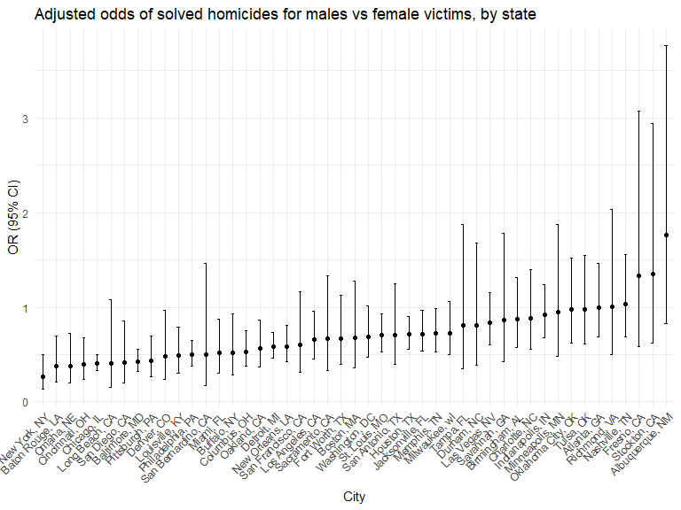

p8105_hw6_vc2692
================
Vaidehi Chudgar
2025-11-29

``` r
library(tidyverse)
```

    ## Warning: package 'tidyverse' was built under R version 4.5.2

    ## ── Attaching core tidyverse packages ──────────────────────── tidyverse 2.0.0 ──
    ## ✔ dplyr     1.1.4     ✔ readr     2.1.5
    ## ✔ forcats   1.0.0     ✔ stringr   1.5.1
    ## ✔ ggplot2   3.5.2     ✔ tibble    3.2.1
    ## ✔ lubridate 1.9.4     ✔ tidyr     1.3.1
    ## ✔ purrr     1.1.0     
    ## ── Conflicts ────────────────────────────────────────── tidyverse_conflicts() ──
    ## ✖ dplyr::filter() masks stats::filter()
    ## ✖ dplyr::lag()    masks stats::lag()
    ## ℹ Use the conflicted package (<http://conflicted.r-lib.org/>) to force all conflicts to become errors

``` r
library(rvest)
```

    ## 
    ## Attaching package: 'rvest'
    ## 
    ## The following object is masked from 'package:readr':
    ## 
    ##     guess_encoding

``` r
library(broom)
library(knitr)

knitr::opts_chunk$set(
    echo = TRUE,
    warning = FALSE,
    fig.width = 8, 
  fig.height = 6,
  out.width = "90%"
)

theme_set(theme_minimal() + theme(legend.position = "bottom"))

options(
  ggplot2.continuous.colour = "viridis",
  ggplot2.continuous.fill = "viridis"
)

scale_colour_discrete = scale_colour_viridis_d
scale_fill_discrete = scale_fill_viridis_d
```

## Problem 1

First I read in data and conduct data cleaning steps.

``` r
homicide_df =
  read_csv("data/homicide-data.csv", na = c(".", "NA", "")) 
```

    ## Rows: 52179 Columns: 12
    ## ── Column specification ────────────────────────────────────────────────────────
    ## Delimiter: ","
    ## chr (9): uid, victim_last, victim_first, victim_race, victim_age, victim_sex...
    ## dbl (3): reported_date, lat, lon
    ## 
    ## ℹ Use `spec()` to retrieve the full column specification for this data.
    ## ℹ Specify the column types or set `show_col_types = FALSE` to quiet this message.

``` r
homicide_df = 
  homicide_df |> 
  unite(city_state, city, state, sep = ", "  ) |> 
  mutate(
    solved = disposition == "Closed by arrest",
    victim_age = as.numeric(victim_age)
    ) |> 
  filter(
    !city_state %in% c("Tulsa, AL", "Dallas, TX", "Phoenix, AZ", "Kansas City, MO"),
    victim_race %in% c("White", "Black")
    )
```

Fitting a logistic regression with resolved vs unresolved as the outcome
and victim age, sex and race as predictors for Baltimore.

``` r
baltimore_df = 
  homicide_df |> 
  filter(city_state == "Baltimore, MD")

baltimore_model =
  glm(solved ~ victim_age + victim_sex + victim_race,
            data = baltimore_df,
            family = binomial()) |> 
  broom::tidy() |> 
  mutate(
    OR = exp(estimate),
    CI_lower = exp(estimate - 1.96*std.error),
    CI_upper = exp(estimate + 1.96*std.error)
  ) |> 
  select(term, OR, CI_lower, CI_upper) |> 
  filter(term == "victim_sexMale") |> 
  kable()


print(baltimore_model)
```

    ## 
    ## 
    ## |term           |        OR| CI_lower|  CI_upper|
    ## |:--------------|---------:|--------:|---------:|
    ## |victim_sexMale | 0.4255117| 0.324559| 0.5578655|

Fitting same logistic regression for all cities and pulling the
estiamted OR and CI

``` r
nested_regression_results = 
  homicide_df |> 
  nest(data = -city_state) |> 
  mutate(
    fits = map(data, \(df) glm(solved ~ victim_age + victim_sex + victim_race,
            data = df,
            family = binomial())),
    results = map(fits, broom::tidy)
  ) |> 
  select(city_state, results) |> 
  unnest(results)

OR_all_city =
  nested_regression_results |> 
  mutate(
    OR = exp(estimate),
    CI_lower = exp(estimate - 1.96*std.error),
    CI_upper = exp(estimate + 1.96*std.error)
  ) |> 
  select(city_state, term, OR, CI_lower, CI_upper) |> 
  filter(term == "victim_sexMale")
```

Making a plot

``` r
OR_all_city |> 
  ggplot(aes(x = reorder(city_state, OR), y = OR)) +
  geom_point() +
  geom_errorbar(aes(ymin = CI_lower, ymax = CI_upper), width = 0.2) +
  labs(
    title = "Adjusted odds of solved homicides for males vs female victims, by state",
    x = "City",
    y = "OR (95% CI)"
  ) +
  theme(axis.text.x = element_text(angle = 45, hjust = 1))
```



In the plot above, we see that that New York has the lowest odds of
solved homicide for males compared to females, after adjusting for
victim age and race (OR: 0.26, 95% CI: 0.14, 0.50). Albuquerque, NM has
the highest odds ratio at 1.77 (95% CI: 0.83,3.76). Fresno, CA,
Stockton, CA, and Albuquerque, NM all have large uncertainty for their
estimates.
